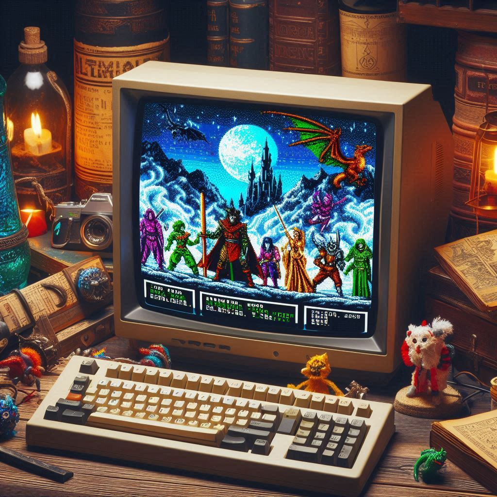

# Resident-Evil-Text-RPG
A text RPG was created as part of CS100 Introduction to Programming at LUMS. It leverages basic programming in C++ with some additional external libraries.
Created as part of a pair with Rafay Saeed Kazmi (25100197@lums.edu.pk) from LUMS. 

